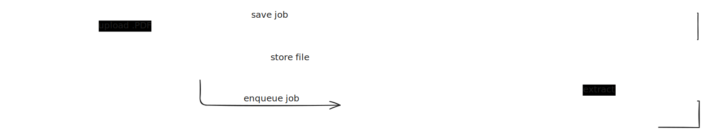

# ocrbase

Turn PDFs into structured data at scale. Powered by frontier open-weight OCR models.

## Quickstart

### Try the Playground

[ocrbase.dev](https://ocrbase.dev) parse and extract data from documents up to 1K page for free.

### Cloud API

1. **Generate an API key** at [ocrbase.dev](https://ocrbase.dev)
2. **Add it to your `.env` file:**
   ```bash
   OCRBASE_API_KEY=sk_xxx
   ```
3. **Install the SDK:**
   ```bash
   npm install ocrbase-sdk
   ```
4. **Parse a document:**

   ```ts
   import { parse } from "ocrbase-sdk";

   const { text } = await parse("./invoice.pdf");
   console.log(text);
   ```

Or use the API directly with curl:

```bash
curl -X POST https://api.ocrbase.dev/v1/parse \
  -H "Authorization: Bearer sk_xxx" \
  -F "file=@document.pdf"
```

### Self-host

Prerequisites: [Bun](https://bun.sh/), Docker Desktop

```bash
git clone https://github.com/majcheradam/ocrbase
cd ocrbase
bun install
cp .env.example .env     # then edit .env — set PADDLE_OCR_URL to your PaddleOCR instance
docker compose up -d     # starts postgres, redis, minio
bun run db:push          # set up the database
bun run dev              # start the API server + worker
```

The API will be available at `http://localhost:3000`. See the [Self-Hosting Guide](./docs/SELF_HOSTING.md) for PaddleOCR setup, GPU configuration, and all environment variables.

## How It Works

ocrbase has two core operations. Both are asynchronous — you submit a request, get a job ID, and retrieve the result when it's ready.

### Parse (`POST /v1/parse`)

Converts a PDF into Markdown. Upload a file and ocrbase OCRs every page and returns clean Markdown text.

```bash
curl -X POST https://api.ocrbase.dev/v1/parse \
  -H "Authorization: Bearer sk_xxx" \
  -F "file=@document.pdf"
```

### Extract (`POST /v1/extract`)

Converts a PDF into structured JSON. You provide a file and a schema ID, and ocrbase OCRs the document then uses an LLM to extract data matching your schema.

```bash
curl -X POST https://api.ocrbase.dev/v1/extract \
  -H "Authorization: Bearer sk_xxx" \
  -F "file=@invoice.pdf" \
  -F "schemaId=inv_schema_123"
```

### Checking Results

**Polling** — fetch the job status until it completes:

```bash
curl https://api.ocrbase.dev/v1/jobs/job_xxx \
  -H "Authorization: Bearer sk_xxx"
```

**WebSocket** — subscribe to real-time status updates instead of polling:

```bash
wscat -c "wss://api.ocrbase.dev/v1/realtime?job_id=job_xxx" \
  -H "Authorization: Bearer sk_xxx"
```

## Features

- **Best-in-class OCR** — uses [PaddleOCR-VL-1.5 0.9B](http://www.paddleocr.ai/main/en/version3.x/pipeline_usage/PaddleOCR-VL.html) for accurate text extraction from PDFs
- **Structured extraction** — define a JSON schema and get structured data back from any document
- **Built for scale** — queue-based job processing with [BullMQ](https://github.com/taskforcesh/bullmq) so you can process thousands of documents
- **Real-time updates** — [WebSocket](https://developer.mozilla.org/en-US/docs/Web/API/WebSockets_API) notifications for job progress instead of polling
- **Self-hostable** — run the entire stack on your own infrastructure with Docker

## SDK

Install the TypeScript SDK from npm:

```bash
npm install ocrbase-sdk
```

[`ocrbase-sdk` on npm](https://www.npmjs.com/package/ocrbase-sdk) | [Source on GitHub](https://github.com/ocrbase-hq/ocrbase/tree/main/packages/sdk)

The SDK provides type-safe methods for parsing, extraction, schema management, and real-time WebSocket subscriptions.

## API Reference

- Interactive OpenAPI UI: `https://api.ocrbase.dev/openapi`
- OpenAPI JSON: `https://api.ocrbase.dev/openapi/json`

## LLM Integration

Parse documents with ocrbase before sending to LLMs. Raw PDF binary wastes tokens and produces poor results — sending clean Markdown from ocrbase gives much better LLM output at a fraction of the cost.

## Architecture



## Tech Stack

| Layer         | Technology                                                    |
| ------------- | ------------------------------------------------------------- |
| Runtime       | [Bun](https://bun.sh/)                                        |
| API Framework | [Elysia](https://elysiajs.com/)                               |
| SDK           | [Eden Treaty](https://elysiajs.com/eden/treaty/overview.html) |
| Database      | PostgreSQL + [Drizzle ORM](https://orm.drizzle.team/)         |
| Queue         | Redis + [BullMQ](https://bullmq.io/)                          |
| Storage       | S3/MinIO                                                      |
| OCR           | [PaddleOCR-VL 1.5](https://github.com/PaddlePaddle/PaddleOCR) |
| Auth          | [Better-Auth](https://better-auth.com/)                       |
| Build         | [Turborepo](https://turbo.build/)                             |

## Self-Hosting

See the [Self-Hosting Guide](./docs/SELF_HOSTING.md) for the full deployment walkthrough including PaddleOCR setup (external URL or self-hosted GPU), all environment variables, and API endpoint reference.

**Requirements:** [Bun](https://bun.sh/), Docker Desktop

## Health Checks

- `GET /v1/health/live` — liveness check
- `GET /v1/health/ready` — readiness check (confirms all dependencies are connected)

## Star History

[](https://www.star-history.com/#ocrbase-hq/ocrbase&type=timeline&logscale&legend=top-left)

## License

MIT — See [LICENSE](LICENSE) for details.

## Contact

For API access, on-premise deployment, or questions: adammajcher20@gmail.com
